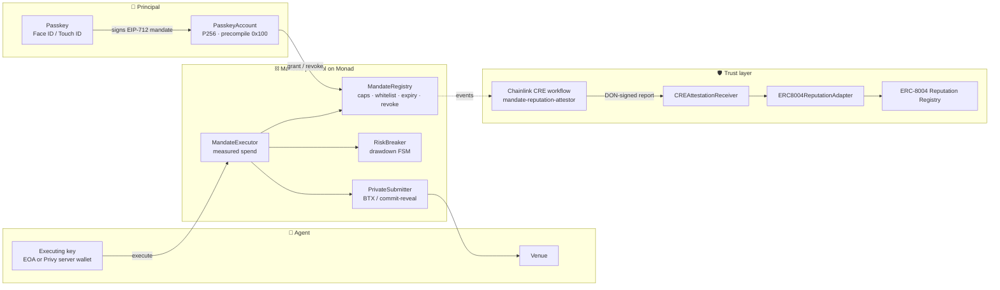

<div align="center">


# Mandate

### Delegation and trust for the agent economy on Monad

**A person authorises an AI agent from a passkey. The chain enforces the box. The agent earns reputation it cannot forge.**

[](https://mandate.ibxlab.com/)
[](https://www.npmjs.com/package/@ibxlab/mandate)
[](https://aliveevie.github.io/mandate/)
[](https://testnet.monadexplorer.com/address/0x46441BC77a4dDbaE7004943E0ab9cB01c76092fA)
[](https://github.com/aliveevie/mandate/actions/workflows/ci.yml)
[](LICENSE)

<br />

| 🎬 **Demo video** | 🎤 **Pitch video** | 🖥️ **Live app** | 📦 **SDK** | 📚 **Docs** |
|:--:|:--:|:--:|:--:|:--:|
| [youtu.be/_R_VSHOQZa8](https://youtu.be/_R_VSHOQZa8) | [youtu.be/mM2-6TfDsrc](https://youtu.be/mM2-6TfDsrc) | [mandate.ibxlab.com](https://mandate.ibxlab.com/) | [npm](https://www.npmjs.com/package/@ibxlab/mandate) | [site](https://aliveevie.github.io/mandate/) |

</div>

---

## Why

AI agents are getting wallets. Today that means handing them keys the app limits off-chain, revocation that only works while the app is online, and reputation the agent reports about itself. Every team rebuilds the same four things: a key scheme, a spend limiter, a circuit breaker, and some notion of "is this agent any good".

**Mandate is that layer, once, as a protocol.** A *mandate* is a signed, on-chain authorisation from a person to an agent: which contracts and functions, a lifetime cap and a per-block cap, a drawdown limit that trips a breaker, an expiry, and a kill switch that lands in one block. It is signed with a passkey and verified on-chain through Monad's P256 precompile. The agent is an ERC-8004 identity, and its compliance becomes portable reputation written only from evidence.

Mandate is infrastructure. The reference app exists to prove the SDK; the customers are the wallets, agent platforms and agent developers who build on it.

## How it fits together



| Building block on Monad | What Mandate does with it |
|---|---|
| **P256 precompile (RIP-7212) · WebAuthn** | `PasskeyAccount` is owned by a passkey. Every mandate, owner action and revoke is a WebAuthn assertion verified on-chain at `0x100`. With Mera PRF the same passkey also derives the key that encrypts the agent's strategy and the keys that own each agent's identity. |
| **ERC-8004** | Every agent is an ERC-8004 identity, optionally owned by a passkey-derived key. Reputation is written into the canonical Reputation Registry only by the Chainlink CRE workflow's on-chain identity, from an evidence hash anyone can recompute. |
| **BTX encrypted mempool** | `PrivateSubmitter` runs in BTX mode on testnet so mandated calls are not observable before inclusion. A commit-reveal mode ships behind the same interface (`SUBMITTER_MODE=1`). BTX is the production target. |

## Thirty seconds of code

```bash
pnpm add @ibxlab/mandate viem
```

```ts
import { createMandateClient, MandateError } from "@ibxlab/mandate";

const client = createMandateClient({ chain: monadTestnet, rpcUrl, signer: relayer });

// Principal: a passkey owns a smart account on Monad; one tap signs the mandate
const principal = (await client.passkey.load()) ?? (await client.passkey.create({ rpId: location.hostname }));
const signed = await client.mandate.sign(
  client.mandate.build({ agentId, agentKey, targets: [{ address: venue, selectors: ["buy(address,uint256)"] }], spendCap, perBlockCap, maxDrawdownBps: 1500, validUntil }),
  principal,
);
await client.mandate.grant(signed);

// Agent: reads its bounds from the chain and is refused, before sending, for anything outside them
const agent = client.agent.load({ mandateHash: signed.hash, executor: agentKeyAccount });
try { await agent.execute({ target: venue, data, amount }); }
catch (e) { if (e instanceof MandateError) console.log(e.name, e.args); } // TargetNotAllowed · SpendCapExceeded · Tripped · MandateRevoked …

// Anyone: reputation written from evidence, mirrored into ERC-8004
const rep = await client.reputation.get(agentId); // { score, trips, executed, pnlBps, erc8004 }
```

## SDK

| | |
|---|---|
| **Package** | [`@ibxlab/mandate` on npm](https://www.npmjs.com/package/@ibxlab/mandate) · `pnpm add @ibxlab/mandate viem` · MIT |
| **Entry points** | `@ibxlab/mandate` (client, typed errors, EIP-712 helpers, ABIs, addresses) · `@ibxlab/mandate/prf` (Mera PRF: policy vaults, per-agent identities) · `@ibxlab/mandate/privy` (server wallets, mirrored policies, session signers) |
| **Reference** | [SDK reference](https://aliveevie.github.io/mandate/sdk-reference/) · [Quickstart](https://aliveevie.github.io/mandate/quickstart/) · [Integrate in 15 minutes](https://aliveevie.github.io/mandate/integrate/) |
| **Examples** | [`sdk/examples/quickstart.ts`](sdk/examples/quickstart.ts) (whole protocol, one run) · [`agent-runner.ts`](sdk/examples/agent-runner.ts) (agent side) · [`agent-tool.ts`](sdk/examples/agent-tool.ts) (one `execute_under_mandate` tool for any LLM agent loop) |
| **Guarantees** | Every Solidity custom error surfaces as a typed `MandateError` **before** a transaction is sent · reads batched through one multicall-aware transport · anvil end-to-end tests with the real P256 precompile |
| **Source** | [`sdk/`](sdk/) |

## Deployed contracts · Monad testnet (chain id 10143)

| Contract | Address | Deployment |
|---|---|---|
| **MandateRegistry** | [`0x46441BC77a4dDbaE7004943E0ab9cB01c76092fA`](https://testnet.monadexplorer.com/address/0x46441BC77a4dDbaE7004943E0ab9cB01c76092fA) | [tx](https://testnet.monadexplorer.com/tx/0x45d43b0e7858ccc7126224a2c8328b8b3812d10f51a934b3e30411bdb4c4d9fd) |
| **RiskBreaker** | [`0xf4c2F2373a17e3a2122f984D512B0B2EabA26374`](https://testnet.monadexplorer.com/address/0xf4c2F2373a17e3a2122f984D512B0B2EabA26374) | [tx](https://testnet.monadexplorer.com/tx/0x1f16e701ed354772b26acac1dfa2c0fda0e6cb501f7c8d09ab8142dfb73f11ad) |
| **MandateExecutor** | [`0xbb2d989876BFdf63CDFf7bb480A667175cF12409`](https://testnet.monadexplorer.com/address/0xbb2d989876BFdf63CDFf7bb480A667175cF12409) | [tx](https://testnet.monadexplorer.com/tx/0x9d4aaba15e96cbf8f858465e2c78c06a9022975b51b6088e6ab068424671d68a) |
| **PrivateSubmitter** (BTX mode) | [`0xC552018AA7A9001e1dEcdfe40dAe38Dd6C5ca9D9`](https://testnet.monadexplorer.com/address/0xC552018AA7A9001e1dEcdfe40dAe38Dd6C5ca9D9) | [tx](https://testnet.monadexplorer.com/tx/0xdaccdf34cf6a480b2df7ab58b7f0bc13ab407dcf5e377b8a7050eeed1ecab7fd) |
| **ERC8004ReputationAdapter** | [`0x3b1d977C1270dF25252041D0671b6FD90dF7a757`](https://testnet.monadexplorer.com/address/0x3b1d977C1270dF25252041D0671b6FD90dF7a757) | [tx](https://testnet.monadexplorer.com/tx/0xfbaa87df536aa3337435ca96d0e86b04621b343acd1bbcb34fac4523aa41e2ca) |
| **CREAttestationReceiver** (the attestor) | [`0x0c89d72a5ABf96556EEB14c31d87D55c7ECCC573`](https://testnet.monadexplorer.com/address/0x0c89d72a5ABf96556EEB14c31d87D55c7ECCC573) | [tx](https://testnet.monadexplorer.com/tx/0x94aa5c901570d4221e8a6defaa10e7e74aa42e7fd7288c454ab588c77b2640af) |

| External | Address |
|---|---|
| P256 precompile (RIP-7212) | [`0x0000000000000000000000000000000000000100`](https://testnet.monadexplorer.com/address/0x0000000000000000000000000000000000000100) |
| ERC-8004 Identity Registry | [`0x8004A818BFB912233c491871b3d84c89A494BD9e`](https://testnet.monadexplorer.com/address/0x8004A818BFB912233c491871b3d84c89A494BD9e) |
| ERC-8004 Reputation Registry | [`0x8004B663056A597Dffe9eCcC1965A193B7388713`](https://testnet.monadexplorer.com/address/0x8004B663056A597Dffe9eCcC1965A193B7388713) |
| Chainlink KeystoneForwarder · MockKeystoneForwarder | [`0xF8344CFd5c43616a4366C34E3EEE75af79a74482`](https://testnet.monadexplorer.com/address/0xF8344CFd5c43616a4366C34E3EEE75af79a74482) · [`0xB9F79d863261869B234c481D1f9A7af84AeAd192`](https://testnet.monadexplorer.com/address/0xB9F79d863261869B234c481D1f9A7af84AeAd192) |
| Demo asset · demo venue | [`0x918598c87e38A6CB6C08684712A784A2FfFD3731`](https://testnet.monadexplorer.com/address/0x918598c87e38A6CB6C08684712A784A2FfFD3731) · [`0x3eC5A0C8a382AABfD765FA574C8aCc1C02e37216`](https://testnet.monadexplorer.com/address/0x3eC5A0C8a382AABfD765FA574C8aCc1C02e37216) |

Every transaction hash, including the end-to-end run and the first mirrored attestation, is recorded in [`contracts/deployments/monad-testnet.json`](contracts/deployments/monad-testnet.json).

## Integrations

<table>
<tr>
<td width="33%" valign="top">

### 🔐 Privy
**Pull request [#2](https://github.com/aliveevie/mandate/pull/2)**

Agent keys are **Privy server wallets**. Every granted mandate is mirrored as a **wallet policy** on the agent wallet (allowed contract, calldata, per-block amount, expiry; deny-all after revocation), so Privy refuses out-of-mandate calls before a signature exists. Principals without a passkey device sign in with Privy and delegate a **scoped session signer** that may sign Mandate typed data and nothing else.

Proof: `pnpm --filter server e2e:privy` · [Docs](https://aliveevie.github.io/mandate/integrations/#privy)

</td>
<td width="33%" valign="top">

### 🔗 Chainlink CRE
**Pull request [#7](https://github.com/aliveevie/mandate/pull/7)** · hardened in [#9](https://github.com/aliveevie/mandate/pull/9)

The `mandate-reputation-attestor` workflow is the **only writer of reputation**. It reads the window on-chain and from the indexer, adds a market feed and a structured LLM risk note, scores compliance, commits every input in an **evidence hash**, and delivers the attestation through the KeystoneForwarder to `CREAttestationReceiver`. Simulation logs are committed; attestations are live on testnet.

Proof: [`cre/simulation-broadcast.log`](cre/simulation-broadcast.log) · [Docs](https://aliveevie.github.io/mandate/integrations/#chainlink-cre)

</td>
<td width="33%" valign="top">

### 🗝️ Mera PRF
**Pull request [#8](https://github.com/aliveevie/mandate/pull/8)**

**One passkey, many keys.** `mandate:policy:<principal>:<nonce>` derives the AES-256-GCM key for the agent's encrypted strategy; the mandate's `policyHash` commits to the ciphertext. `mandate:agent-id:<n>` derives the secp256k1 key that **owns** agent *n*'s ERC-8004 identity. Nothing derived is stored; on a fresh device the passkey alone re-derives both.

Proof: the fresh-device check in `pnpm --filter web e2e` · [Docs](https://aliveevie.github.io/mandate/integrations/#mera-prf)

</td>
</tr>
</table>

## Pull requests

| # | Merged | Scope |
|---|---|---|
| [#1](https://github.com/aliveevie/mandate/pull/1) | 2026-09-14 | Core: contracts, SDK, indexer, docs and reference app on Monad testnet |
| [#2](https://github.com/aliveevie/mandate/pull/2) | 2026-09-15 | Privy: server wallets as agent keys, policies that mirror mandates, scoped session signers |
| [#3](https://github.com/aliveevie/mandate/pull/3) | 2026-09-15 | Wallet connect: EIP-6963 picker, no `requestPermissions`, visible errors |
| [#4](https://github.com/aliveevie/mandate/pull/4) | 2026-09-15 | Human-readable errors; cancellations are not failures |
| [#5](https://github.com/aliveevie/mandate/pull/5) | 2026-09-15 | Faucet button in the header and on gas errors |
| [#6](https://github.com/aliveevie/mandate/pull/6) | 2026-09-15 | Pinned vulnerable transitive dependencies; `pnpm audit` in CI |
| [#7](https://github.com/aliveevie/mandate/pull/7) | 2026-09-16 | Chainlink CRE: `mandate-reputation-attestor`, the single writer of reputation |
| [#8](https://github.com/aliveevie/mandate/pull/8) | 2026-09-19 | Mera PRF: encrypted agent policy and passkey-owned agent identities |
| [#9](https://github.com/aliveevie/mandate/pull/9) | 2026-09-20 | Hardening: principal-bound sessions, persisted vaults, DON-safe CRE consensus, evidence v2 |
| [#10](https://github.com/aliveevie/mandate/pull/10) | 2026-09-20 | Developer surface: integration guide, SDK reference, adopters, roadmap, runnable examples |

## The reference app

**[mandate.ibxlab.com](https://mandate.ibxlab.com/)** · no credentials needed · Monad testnet · [walk-through](https://aliveevie.github.io/mandate/try-it/)

1. **Passkey** — create a passkey; its `PasskeyAccount` is deployed and seeded with demo tokens; approve the venue with a passkey-signed owner transaction.
2. **Grant** — provision an ERC-8004 agent, claim its identity with a passkey-derived key, encrypt the strategy to the passkey, sign a scoped mandate.
3. **Agent** — run the agent; watch spend against caps and the breaker gauge; force an out-of-bounds call and see the typed revert; revoke with the passkey.
4. **Reputation** — the agent's ERC-8004 score, attestation history and evidence hashes, written by the CRE workflow.

Two ways to pay gas, one way to authorise: the passkey always authorises. With a wallet connected, your wallet pays and registers your own agent; without one, the app runs gasless and the relayer pays.

Automated proofs against a running app: `pnpm --filter server e2e` (the whole flow through the API) and `pnpm --filter web e2e` (real Chrome with a WebAuthn virtual authenticator: passkey creation, four PRF ceremonies, on-chain P256 verification, breaker trip, revoke, fresh-device re-derivation).

## Security

[`docs/security.md`](docs/security.md) holds the threat model, the seven security properties with the tests that prove them, the Slither triage and the scope notes.

| Property | Proof |
|---|---|
| An agent can never exceed `spendCap` or `perBlockCap` | invariants + unit tests |
| An agent can never call a non-whitelisted target or selector | invariants + unit tests |
| Revocation takes effect in the block it is mined | unit test |
| Breaker tripped ⇒ zero executions until re-armed | invariant |
| A mandate signature is bound to chain id and registry | unit tests |
| Only the attestor can write reputation | unit tests |
| No secret ever in a contract, log, committed file or server database | gitleaks over full history in CI |

92 Foundry tests including invariants · anvil end-to-end with the real P256 precompile · principal-bound sessions and ownership checks on every agent route · rate limits · ciphertext-only vault store · `pnpm audit` and Slither in CI.

## Repository

| Path | Contents |
|---|---|
| [`contracts/`](contracts/) | Foundry: `MandateRegistry`, `PasskeyAccount`, `SignerAccount`, `RiskBreaker`, `MandateExecutor`, `PrivateSubmitter`, `ERC8004ReputationAdapter`, `CREAttestationReceiver`; tests, invariants, deploy scripts |
| [`sdk/`](sdk/) | `@ibxlab/mandate`: client, typed errors, `prf` and `privy` entry points, examples, anvil e2e |
| [`apps/server/`](apps/server/) | Express API and agent runner: relayer, sessions, ERC-8004 registration, Privy wiring, policy blob store |
| [`apps/web/`](apps/web/) | Vite + React reference client |
| [`cre/`](cre/) | Chainlink CRE workflow, simulation logs, evidence verifier |
| [`indexer/`](indexer/) | Envio HyperIndex: mandates, executions, breaker events, attestations |
| [`docs/`](docs/) | mkdocs site, built with `--strict` in CI |

## Run it locally

```bash
pnpm install && pnpm --filter @ibxlab/mandate build
cd apps/server && DEMO_AGENT_DEPLOYER_KEY=0x… pnpm dev   # API + agent runner; the key only pays gas
cd apps/web && pnpm dev                                  # http://localhost:5173
```

Single Docker image (UI + API): `docker build -t mandate-reference . && docker run -p 8787:8787 -v mandate-data:/app/data -e DEMO_AGENT_DEPLOYER_KEY=0x… mandate-reference`. Add the four `PRIVY_*` variables to turn on the Privy features. `render.yaml` deploys the same image.

## Docs

[Overview](https://aliveevie.github.io/mandate/) · [Quickstart](https://aliveevie.github.io/mandate/quickstart/) · [Integrate in 15 minutes](https://aliveevie.github.io/mandate/integrate/) · [SDK reference](https://aliveevie.github.io/mandate/sdk-reference/) · [Concepts](https://aliveevie.github.io/mandate/concepts/) · [Contracts](https://aliveevie.github.io/mandate/contracts/) · [Indexer](https://aliveevie.github.io/mandate/indexer/) · [Security](https://aliveevie.github.io/mandate/security/) · [Integrations](https://aliveevie.github.io/mandate/integrations/) · [Try the app](https://aliveevie.github.io/mandate/try-it/) · [Who builds on Mandate](https://aliveevie.github.io/mandate/adopters/) · [Roadmap](https://aliveevie.github.io/mandate/roadmap/)

## Contributing and integrating

See [`CONTRIBUTING.md`](CONTRIBUTING.md). Building on Mandate? Open an [integration issue](https://github.com/aliveevie/mandate/issues/new?template=integration.yml) for a review of your mandate parameters and a listing in the docs.

<div align="center">

**IBX Lab** · MIT License

</div>
